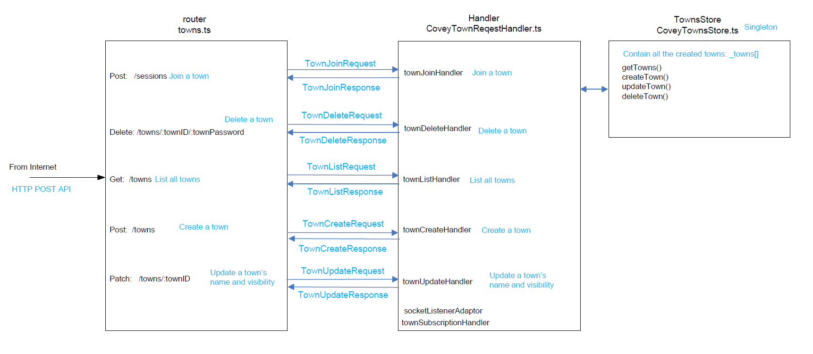
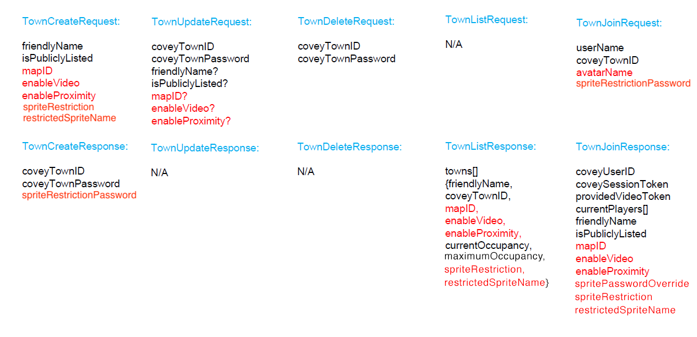
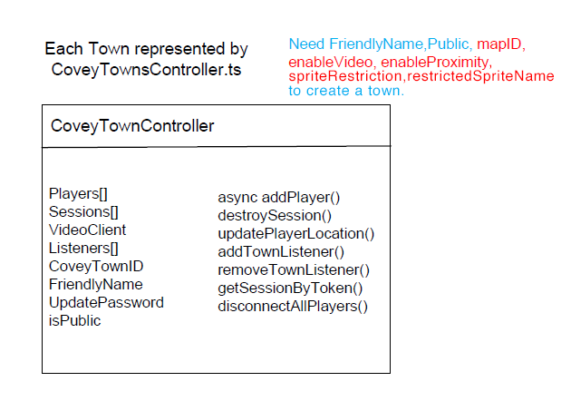
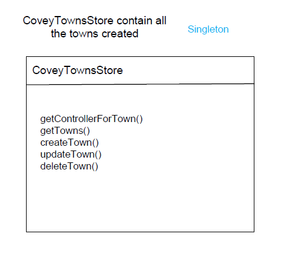
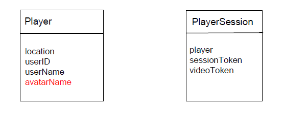
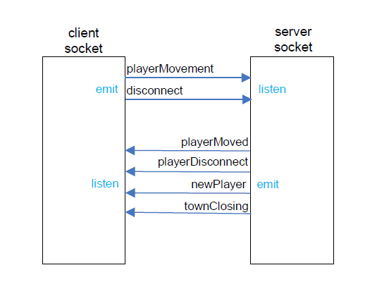
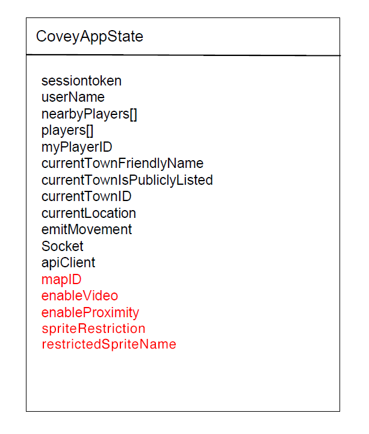
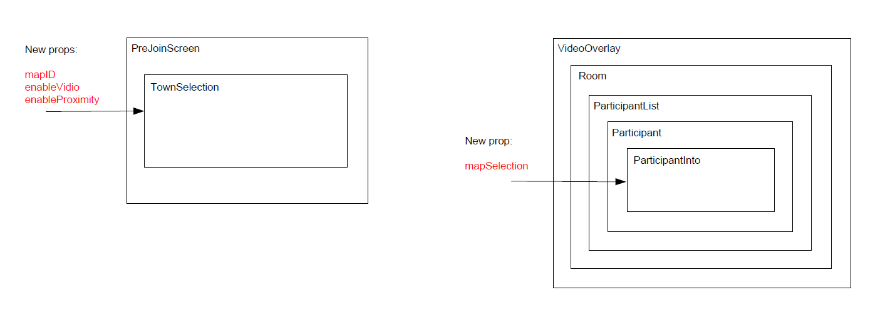

# Covey.Town Design

The new features in this implementation include map selection, avatar selection / restriction, as well as voice and video range selection. All these features required both frontend and backend changes.

The figure below depicts the detailed architecture of the backend.

The definition of different requests and responses are listed below (the colored fields are added by our team for the new feature implementation).

The mapID is used to select different maps. The enableVideo allows the host to enable or disable video for users to extend bandwidth. The enableProximity can disable the proximity feature, allowing the entire room to hear and see each other. The avatarName is used to let user select different avatars. The spriteRestriction represents what type of avatar restriction is present in a town. The restrictedSpriteName is the name of the default avatar for players joining a town with avatar restriction. The spriteRestrictionPassword allows a player to pick any avatar in towns with password protected avatar restriction mode. The spritePasswordOverride is whether a player can circumvent the aforementioned default avatar in password protected avatar towns.

Radio buttons for town map selection and avatar restriction mode easily allow users to change their respective choices. For choosing the name of the default avatar in an avatar restricted town, a select input box is used to list all names in a compact way.

Major classes of the backend are listed in the following drawing.

The socket architecture is shown below.

Backend tests were added to test new backend properties. \
For starters, we tested the CoveyTownController constructor to ensure all new fields were being set or created correctly. \
Then we tested list towns with different mapID, enable video, enable video proximity, sprite restrictions, and restricted sprite names. We tested set and update town setting with mapID, enable video, and enable video proximity parameter. We tested create town with different mapID, enable video, enable video proximity, sprite restrictions, and restricted sprite names. Additionally, we tested create town failing when either password protected or locked avatar restriction mode was enabled AND there was no default avatar name given.

For the frontend, user interface was changed to allow selection and change maps and avatars. The detail is described in FEATURE.md.

The WorldMap was changed to load different maps and select different avatar animations.

CoveyAppState was modified to add more states to pass around.

We pass information to the video control to disable video streaming based on user selection, new props passed to PreJoinScreen.

