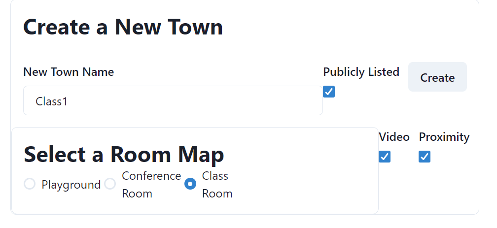
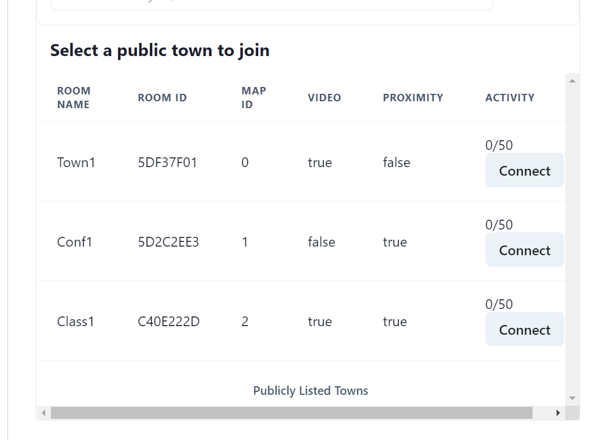
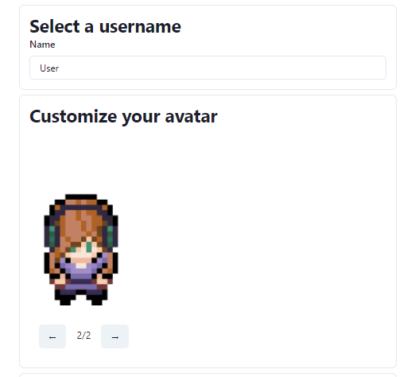

# Covey.Town

This implementation of covey.town allows town creators to choose between different maps when creating a town. The three map choices include a conference room, classroom, and the default playground. In addition to map selection, the program provides different avatars to allow users to express themselves and distinguish themselves from others.

This program also allows users to enable or disable the proximity feature. When proximity is enabled, the players in the town can only see and hear other players nearby. When disabled, all playes in a town and see and hear everyone in the same town. This is particularly useful for professors who would like all students to hear them in a classroom setting.

If the bandwidth is not enough the support a large number of students, there is a feature to turn off videos for all users in the town. This allows everyone to use less bandwidth and be able to hear each other without sacrificing the voice quality.

Below is the user interface that was changed to allow selection of map and enabling/disabling of video and proximity. The town map is selected using radio buttons, and the video and proximity settings can be changed with checkboxes.

The town maps are created with Tiled software, which has no limitations on how many maps a user can create.

Once inside the town, the host, or anyone provided with the password of the town (given from host), can update map selection. Anyone with the town password can also enable/disable video and proximity using the town settings pop-up window. The procedure is the same as updating other town properties, such as name.

Below is the user interface changed to update town features.

The town selection user interface was modified to list out the towns map ID, video and proximity status. As shown below:

Below is the user interface allowing users to select between different avatars.

The following shows an example of a new map along with users using different avatars.

Below is the conference room and classroom layouts.

