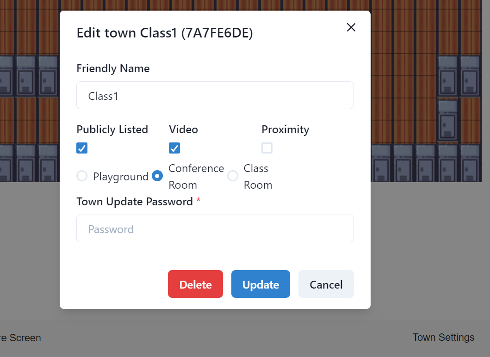

# Covey.Town

This implementation of covey.town allows town creators to choose between different maps when creating a town. The three map choices include a conference room, classroom, and the default playground.

In addition to map selection, the program provides different avatars to allow users to express themselves and distinguish themselves from others. While customization is useful, there might be situations where a town creator wants to limit player avatars and set a particular avatar for all players. To accommodate this, a town creator can choose to either allow no customization whatsoever, meaning all users, including the town creator, will have whatever avatar is set for the town during creation OR the town creator can allow certain users with a password to select whatever avatar while users without a password will be forced to choose the default avatar.\
**Note:** The aforementioned password for overriding avatar restrictions is different from the town update password, but similarly automatically generated and displayed one time to the town creator when the town has been created.

This program also allows users to enable or disable the proximity feature. When proximity is enabled, the players in the town can only see and hear other players nearby. When disabled, all players in a town and see and hear everyone in the same town. This is particularly useful for professors who would like all students to hear them in a classroom setting.

If the bandwidth is not enough the support a large number of students, there is a feature to turn off videos for all users in the town. This allows everyone to use less bandwidth and be able to hear each other without sacrificing the voice quality.

Below is the user interface that was changed to allow selection of map, enabling/disabling of video and proximity, and set avatar customization rules. The town map and avatar customization mode is selected using radio buttons, the video and proximity settings can be changed with checkboxes, and the default avatar is changed with a select input box.\
**Note**: The default sprite select only appears when 'Password Users' or 'No Users' is selected for avatar customization mode to avoid confusion when 'All Users' is selected.

The town maps are created with Tiled software, which has no limitations on how many maps a user can create.

Once inside the town, the host, or anyone provided with the password of the town (given from host), can update map selection. Anyone with the town password can also enable/disable video and proximity using the town settings pop-up window. The procedure is the same as updating other town properties, such as name.

Below is the user interface changed to update town features.

The town selection user interface was modified to list out the towns map ID, video and proximity status. As shown below:

Below is the user interface allowing users to select between different avatars.

The following shows an example of a new map along with users using different avatars.

Below is the conference room and classroom layouts.

